# Bangalore Traffic Pattern Analysis

Live Web App: [https://bangalore-traffic-pred.vercel.app/](https://bangalore-traffic-pred.vercel.app/)

This project has two layers built on the same dataset:

1. **Static Python analysis** (`main.py`) - pandas and matplotlib pipeline that cleans the data, computes all findings, and saves 6 plots as PNGs.
2. **Interactive web layer** (`build_data.py` + `web/`) - all analysis recomputed and exported to JSON, consumed by a 5-page static site with Chart.js charts, a road explorer, and a technical/analyst section.

Dataset: [Bangalore Traffic Pulse - Kaggle](https://www.kaggle.com/datasets/preethamgouda/banglore-city-traffic-dataset) | Records: 8,936 | Period: Jan 2022 to Aug 2024
---

## Dataset Description

| Field | Description |
|---|---|
| `Date` | Observation date (2022 to 2024) |
| `Area Name` | One of 8 Bangalore zones |
| `Road/Intersection Name` | One of 16 specific roads |
| `Traffic Volume` | Vehicle count at the location |
| `Average Speed` | Speed in km/h |
| `Congestion Level` | 0 to 100 scale (100 = fully blocked) |
| `Road Capacity Utilization` | % of road capacity in use |
| `Incident Reports` | Number of incidents recorded |
| `Weather Conditions` | Clear / Fog / Rain / Windy / Overcast |
| `Travel Time Index` | Ratio of travel time vs free-flow |
| `Environmental Impact` | Pollution proxy metric |
| `Public Transport Usage` | % using public transport |
| `Traffic Signal Compliance` | % compliance at signals |
| `Parking Usage` | % parking occupancy |
| `Pedestrian and Cyclist Count` | Foot and cycle traffic |
| `Roadwork and Construction Activity` | Yes / No flag |

---

## Key Findings

### Chokepoints
- **Top 5:** Sony World Junction (94.1), Sarjapur Road (93.8), Anil Kumble Circle (90.8), Trinity Circle (90.4), CMH Road (88.2)
- Top 5 average congestion: **91.5 / 100**, which is **13.2% above the city average of 80.8**
- These 5 roads carry **52.3% of total traffic volume**

### Speed
- City-wide average speed: **39.4 km/h**
- Top 5 chokepoints average speed: **37.3 km/h**
- Worst road - Sony World Junction: **36.0 km/h**
- Least congested roads average: **43.2 km/h** (19% faster)

### Severity
- **52.3% of all 8,936 observations** fall in the Critical (above 90) congestion band
- Sony World Junction is in Critical state **87% of the time**

### Capacity Saturation
- **74.2% of all observations** show roads operating at 100% capacity
- Top 5 chokepoints are at full capacity **89.8% of the time** - structural overload, not peak-hour congestion
- Least congested roads hit full capacity only **40.8% of the time**

### Incidents
- High-congestion zones (above 75) record **2.9x more incidents** than low-congestion zones
- Top 5 roads: avg **1.83 incidents/record** vs **1.03** at the 5 least congested roads

### Economic Impact
*(15-min avg delay, Rs 150/hr wage, Rs 103/litre petrol - stated assumptions)*
- Productivity loss per vehicle: **Rs 37.50**
- Fuel waste per vehicle: **Rs 20.60**
- Estimated daily vehicles at top 5: **~1.85 lakh**
- **Total estimated daily loss: Rs 1.07 crore** (Rs 69.3L productivity + Rs 38.1L fuel)

### Weather
- Windy weather produces the highest congestion: **82.37** (+1.65 vs Clear baseline of 80.72)
- Rain and Overcast are marginally *below* the Clear baseline - congestion is structural, not weather-driven

---

## Assumptions Used

| Assumption | Value | Basis |
|---|---|---|
| Average delay at chokepoint | 15 minutes | Project specification |
| Average hourly wage (Bangalore) | Rs 150/hr | Rs 30,000/month divided by 200 working hours |
| Fuel wasted during 15-min idle | 0.2 litres | Standard petrol car estimate |
| Petrol price | Rs 103/litre | Bangalore approximate price (2024) |
| "Full capacity" threshold | >= 99% utilization | Dataset-based |
| "High congestion" threshold | Congestion Level > 75 | Dataset-based classification |

---

## Static Analysis (main.py)

### Steps Performed

| Step | Description |
|---|---|
| 1 | Load raw data: shape, columns, dtypes |
| 2 | Clean: parse dates, strip whitespace, check nulls, add time features |
| 3 | EDA: descriptive stats + correlation with Congestion Level |
| 4 | Top 5 chokepoints ranked by mean Congestion Level |
| 5 | Economic impact: productivity loss + fuel waste (Rs/day) |
| 6 | Speed analysis: average speed per road, chokepoints highlighted |
| 7 | Capacity saturation: % of time each road runs at 100% capacity |
| 8 | Incident frequency: high vs low congestion zone comparison |
| 9 | Plot: economic impact stacked bar (per road) |
| 10 | Plot: top 5 chokepoints vs city average |
| 11 | Plot: congestion heatmap - day of week x road |
| 12 | Plot: monthly trend - weekday vs weekend (2022 to 2024) |
| 13 | Plot: average speed per road (all 16 roads) |
| 14 | Plot: weather conditions vs congestion level |
| 15 | Congestion severity classification: 4-band breakdown |
| 16 | Final summary printout |

### Plots

<div align="center">

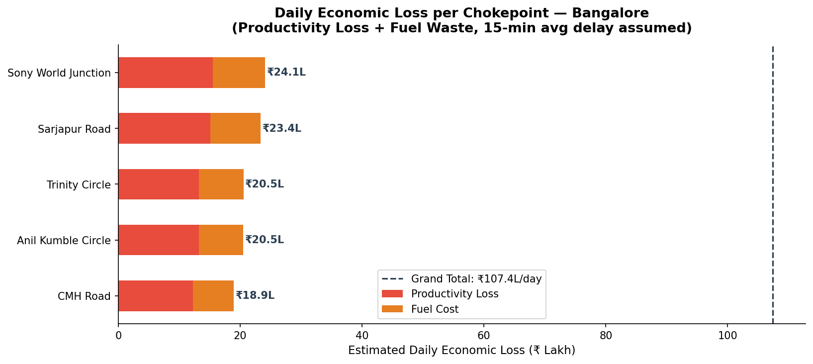
<br>
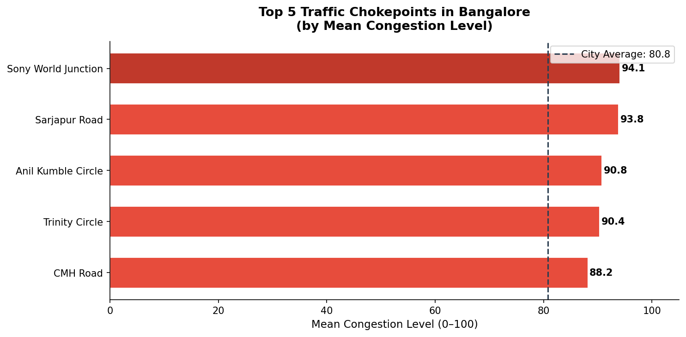
<br>
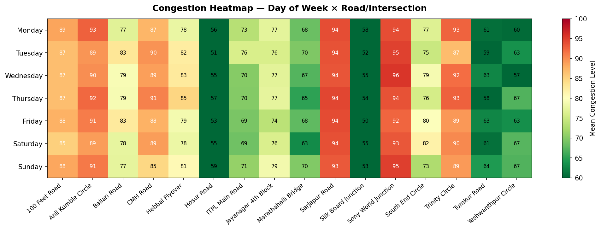
<br>
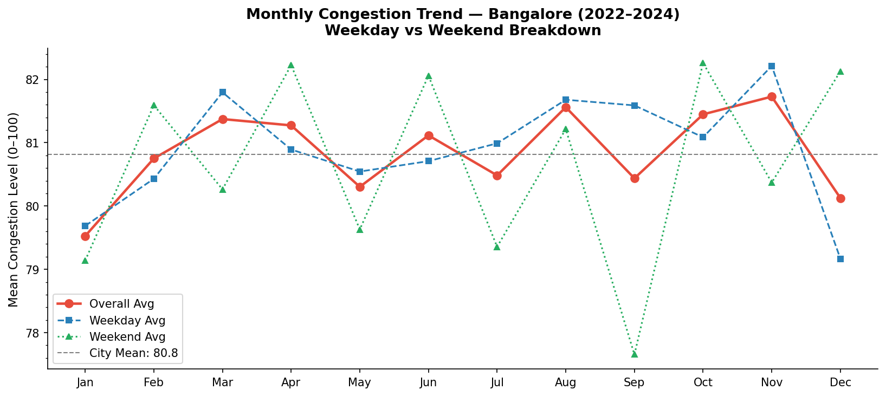
<br>
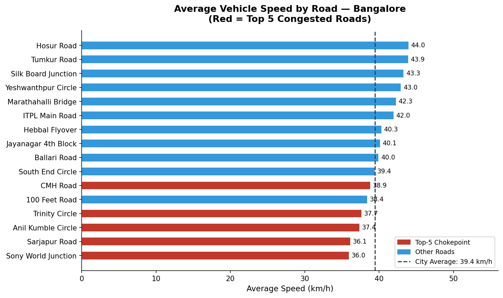
<br>
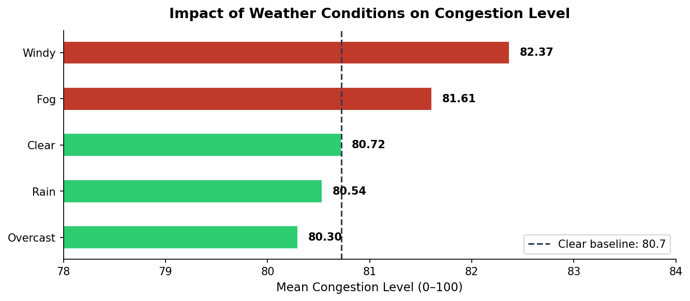
</div>

### How to Run

```bash
pip install pandas matplotlib
python -X utf8 main.py
```

> The `-X utf8` flag ensures the Rs symbol prints correctly on Windows.

---

## Interactive Web Layer

**Live site:** [https://bangalore-traffic-pred.vercel.app](https://bangalore-traffic-pred.vercel.app)

A static, no-backend interactive website deployed on Vercel. All data computation runs once offline in Python (`build_data.py`), results are exported to JSON files, and the web interface loads and renders those files client-side using Chart.js.

The site is structured into two main sections:
- **Consumer-facing Narrative Pages:** City Overview, Road Explorer, Time & Weather Patterns, Economic Impact
- **Technical & Analyst Section:** Pairwise Correlation Matrix, Linear Regression Model Results, K-Means Cluster Archetypes, Anomaly Detection Table

---

### Dashboard Visualizations & Screenshots

<div align="center">

#### 1. City Overview & Key Metrics
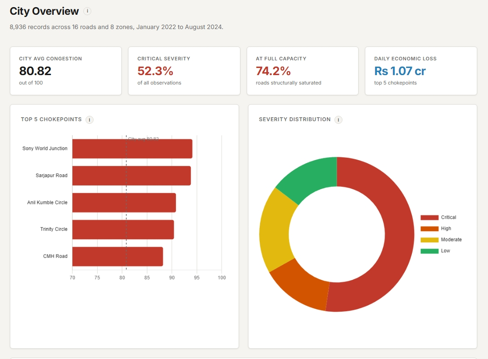
<br>
<em>Summary of overall city metrics: 80.82 average congestion score, 52.3% critical severity share, 74.2% structural capacity saturation, and Rs 1.07 crore daily economic loss across top 5 chokepoints.</em>
<br><br>

#### 2. Interactive Road Explorer
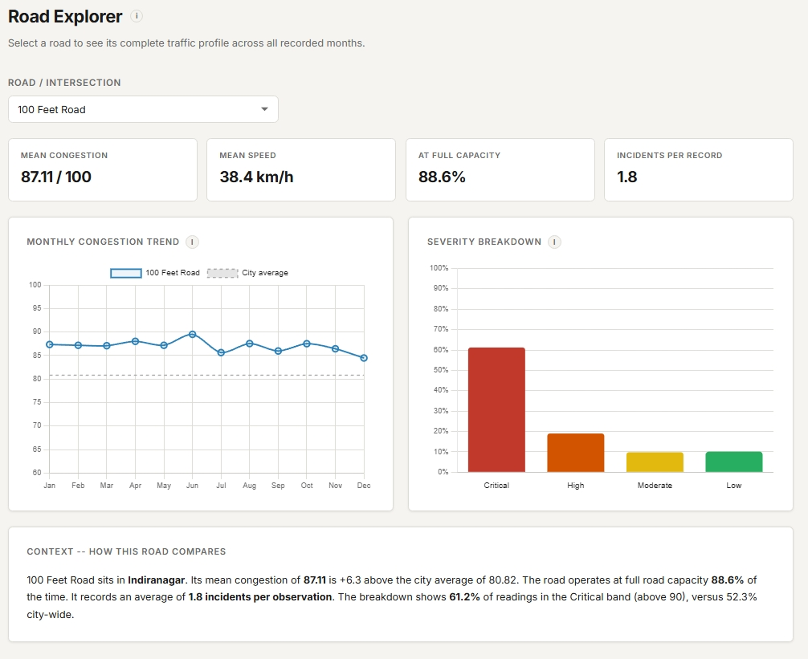
<br>
<em>Per-road interactive profile (shown for 100 Feet Road): displays mean congestion (87.11/100), average speed (38.4 km/h), full capacity percentage (88.6%), incident rates (1.8/record), monthly trend line vs city baseline, and severity distribution breakdown.</em>
<br><br>

#### 3. Time & Weather Patterns Analysis
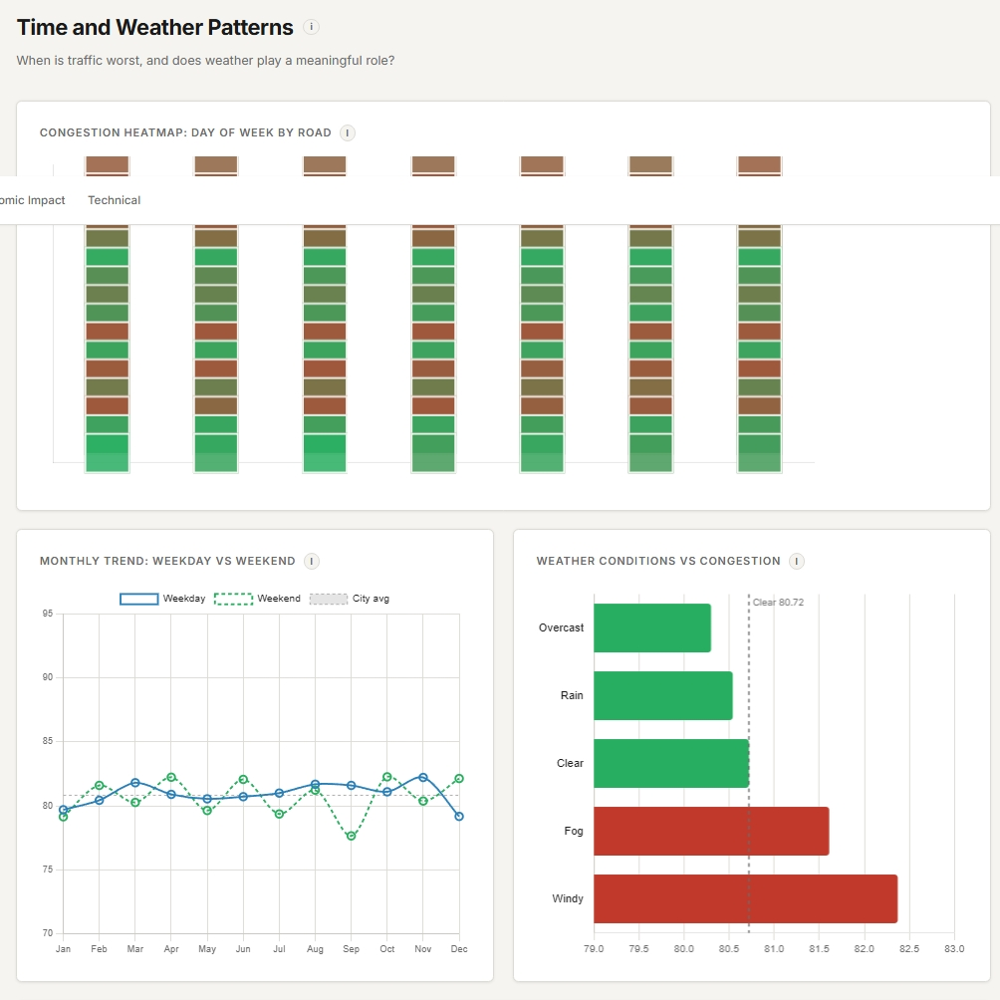
<br>
<em>Day-of-week x road congestion heatmap, monthly weekday vs weekend trend tracking, and weather condition comparisons highlighting structural overload over weather sensitivity.</em>
<br><br>

#### 4. Daily Economic Loss Breakdown
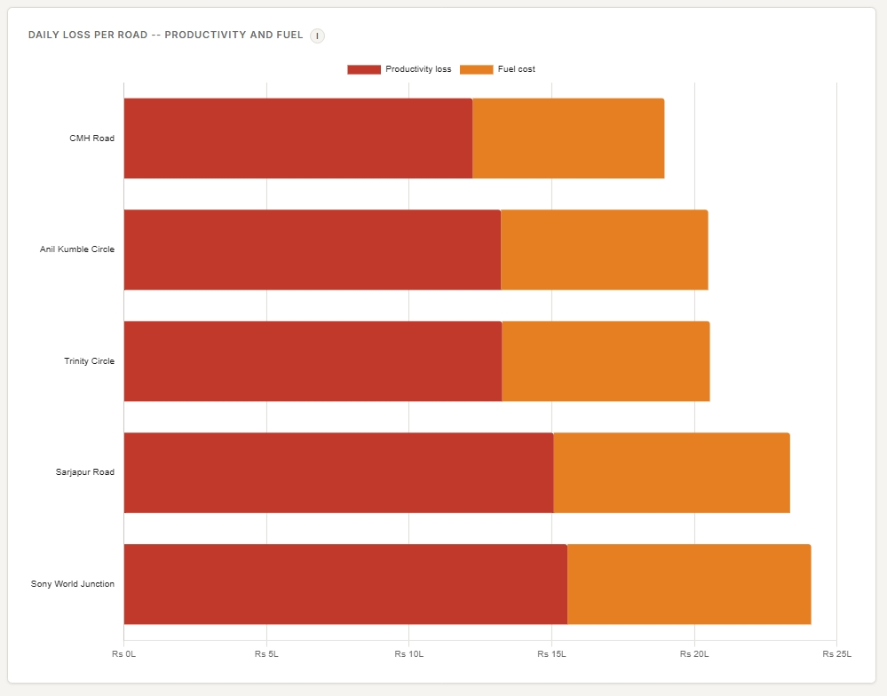
<br>
<em>Stacked economic loss breakdown per top-5 chokepoint differentiating commuter productivity loss (Rs 37.50/vehicle) and fuel waste (Rs 20.60/vehicle).</em>
<br><br>

#### 5. Pairwise Correlation Matrix (Technical Section)
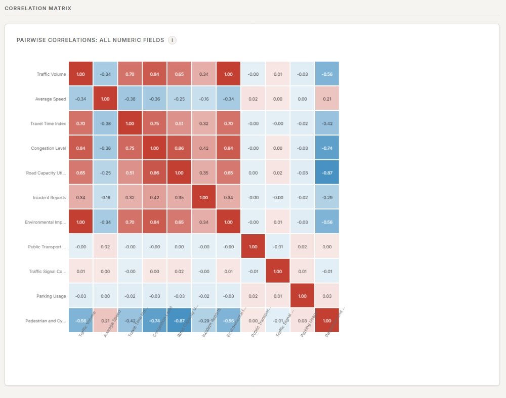
<br>
<em>Full correlation matrix heatmap across 11 numeric parameters including Traffic Volume, Average Speed, Congestion Level, Travel Time Index, Road Capacity Utilization, and Incident Reports.</em>
<br><br>

#### 6. K-Means Road Cluster Archetypes (Technical Section)
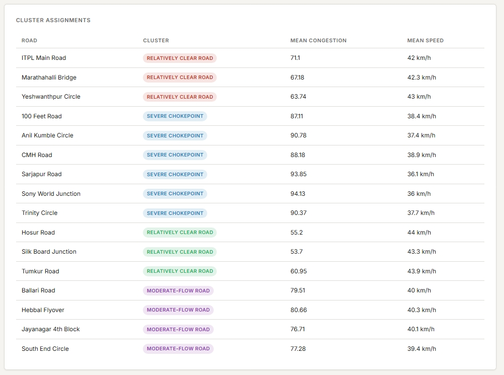
<br>
<em>K-Means clustering assignments categorizing all 16 roads into archetype groupings: Severe Chokepoint, Relatively Clear Road, and Moderate-Flow Road with mean speeds and congestion scores.</em>

</div>

---

### Pages

| Page | Audience | Content |
|---|---|---|
| Overview | General | KPI strip, top-5 bar, severity doughnut, all-roads speed comparison |
| Road Explorer | General | Per-road monthly trend vs city average, severity breakdown, speed, capacity, incidents |
| Patterns | General | Day-of-week x road heatmap, weekday/weekend monthly trend, weather bar |
| Economic Impact | General | Rs 1.07 crore/day hero figure, stacked bar per road (productivity + fuel) |
| Technical | Analysts | Correlation matrix, regression coefficients + R2/MAE, k-means PCA scatter, anomaly table |

### Technical Layer Details

- **Correlation matrix:** Pearson correlation across all 11 numeric fields
- **Regression model:** Ordinary least squares predicting Congestion Level from 10 features (features standardised before fitting)
- **Clustering:** k-means (k=4) on 6 road-level aggregates, visualised via PCA reduction to 2D
- **Anomaly detection:** Per-road z-score flagging (threshold: z > 2.5 vs that road's own baseline)

### Project Structure

```
build_data.py           offline computation script (run once)
data/                   generated JSON files
  kpis.json
  roads.json
  heatmap.json
  weather.json
  economic.json
  correlation.json
  model.json
  clusters.json
  anomalies.json
  monthly_trend.json
web/                    static site
  index.html
  explorer.html
  patterns.html
  impact.html
  technical.html
  css/style.css         design system with light/dark CSS variables
  js/theme.js           icon-only dark/light toggle, persists in localStorage
  js/info.js            reusable info tooltip component (hover desktop, tap mobile)
  data/                 copy of JSON files for local serving
vercel.json             Vercel config
```

### How to Run Locally

```bash
pip install pandas scikit-learn numpy
python -X utf8 build_data.py
python -m http.server 8765 --directory web
```

Then open `http://localhost:8765/index.html` in a browser.

### How to Regenerate Data

If `data.csv` is updated, run `build_data.py` again. It overwrites all JSON files in `data/` and `web/data/` without touching `main.py` or any other file.

### Deploying to Vercel

Connect the repo to Vercel. The `vercel.json` sets `web/` as the output directory and copies the `data/` JSON files into `web/data/` at build time so fetch paths resolve correctly.

---
